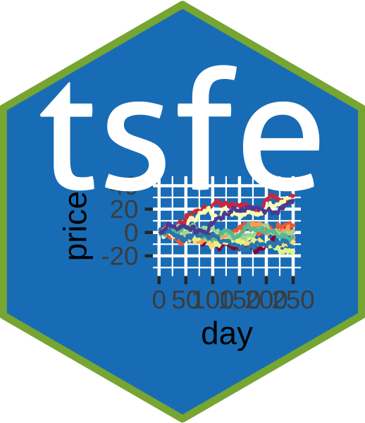

<!-- README.md is generated from README.Rmd. Please edit that file -->

# tsfe



This package contains templates for reports, and functions and workshops
using in [*Time series financial
econometrics*](https://canvas.qub.ac.uk/courses/11736) taught by [Barry
Quinn](https://quinference.com/) inb Queen’s Management School.

## Installation

``` r
remotes::install_github("barryquinn1/tsfe")
```

And the development version from [GitHub](https://github.com/) with:

``` r
# install.packages("devtools")
devtools::install_github("barryquinn1/tsfe")
```

## Example

This is a basic example which shows you how to solve a common problem:

``` r
library(tsfe)
## basic example code
data("ftse350")  # This is a 2MB file so might take some time to initially load
summary(ftse350)
#>      Name              ticker            variable              date           
#>  Length:1014400     Length:1014400     Length:1014400     Min.   :2016-04-29  
#>  Class :character   Class :character   Class :character   1st Qu.:2017-06-14  
#>  Mode  :character   Mode  :character   Mode  :character   Median :2018-07-20  
#>                                                           Mean   :2018-07-13  
#>                                                           3rd Qu.:2019-08-14  
#>                                                           Max.   :2020-09-01  
#>      value          
#>  Min.   :     1.05  
#>  1st Qu.:   373.10  
#>  Median :   893.92  
#>  Mean   :  3273.80  
#>  3rd Qu.:  2210.00  
#>  Max.   :159163.60
```

## Tutorials

You can start the tutorials in one of two ways. First, in RStudio 1.3 or
later, you will find the ATI tutorials listed in the “Tutorial” tab in
the top-right pane (by default). Find a tutorial and click “Run
Tutorial” to get started. Second, you can run any tutorial from the R
console by typing the following line:

``` r
learnr::run_tutorial("Workshop2","tsfe")
```

This should bring up a tutorial in your default web browser. You can see
the full list of tutorials by running:

``` r
learnr::run_tutorial(package = "tsfe")
```

If you would like to access the raw RMarkdown code which created these
tutorials you can do so
[here](https://github.com/barryquinn1/tsfe/tree/master/inst/tutorials)

## Project Report

This package also includes a RMarkdown template for use in the project
report. Go to File\>New\>R Markdown… and choose from `From Template`
then `project-report`. There are four sections in the report

  - Introduction and literature review
  - Data and methodology
  - Results
  - Discussion

The marks are allocated equally to each section.

### Indicative marking scheme

<table class=" lightable-paper" style='font-family: "Arial Narrow", arial, helvetica, sans-serif; margin-left: auto; margin-right: auto;'>

<thead>

<tr>

<th style="text-align:left;">

criterion

</th>

<th style="text-align:left;">

description\_Expectation not met

</th>

<th style="text-align:left;">

description\_Approaching Expectation

</th>

<th style="text-align:left;">

description\_Meets Expectation

</th>

<th style="text-align:left;">

description\_Exceeds Expectation

</th>

<th style="text-align:left;">

value\_Expectation not met

</th>

<th style="text-align:left;">

value\_Approaching Expectation

</th>

<th style="text-align:left;">

value\_Meets Expectation

</th>

<th style="text-align:left;">

value\_Exceeds Expectation

</th>

</tr>

</thead>

<tbody>

<tr>

<td style="text-align:left;">

Intro+Lit

</td>

<td style="text-align:left;">

The introduction needs a lot more work. A poor and incomplete review of
the literature which doesn’t show any critical ability.

</td>

<td style="text-align:left;">

The introduction broadly sets out the problem but could be much
improved. The literature review requires more content and critical
comment.

</td>

<td style="text-align:left;">

An adequate introduction which broadly sets out the problem. A good
literature review that sets out some of the relevant literature but need
more critique.

</td>

<td style="text-align:left;">

A very good introduction which is easy to read and introduces the
problem well, setting out the overall project aim. A very good
literature review, detailing the relevant literature and critiquing it.

</td>

<td style="text-align:left;">

5

</td>

<td style="text-align:left;">

15

</td>

<td style="text-align:left;">

20

</td>

<td style="text-align:left;">

25

</td>

</tr>

<tr>

<td style="text-align:left;">

Data+methods

</td>

<td style="text-align:left;">

A poor model is used with very little critical comment.

</td>

<td style="text-align:left;">

Appropriate model and estimation techniques are used but little critique
is used.

</td>

<td style="text-align:left;">

A good model construct and use of the standard estimation techniques.
There is some critique of the methods.

</td>

<td style="text-align:left;">

A very good model construction with critical comments of its use.
Estimation techniques are well laid out and critiqued, with some
improvements mentioned.

</td>

<td style="text-align:left;">

5

</td>

<td style="text-align:left;">

15

</td>

<td style="text-align:left;">

20

</td>

<td style="text-align:left;">

25

</td>

</tr>

<tr>

<td style="text-align:left;">

Results

</td>

<td style="text-align:left;">

Results are not well defined and the use of tables and graphs needs much
more work.

</td>

<td style="text-align:left;">

Poor use of graphs and tables. Inferences are poor and are not well
related to previous empirical research.

</td>

<td style="text-align:left;">

There is appropriate use of both tables and graphs. The inferences on
results are good but have sparse critical comments. Improvement could be
made with more contextual comment about previous empirical results.

</td>

<td style="text-align:left;">

Very good use is made of both tables and graphs. The most interesting
features of the results are well identified with inferences related to
overall project aims. A excellent critique of your results using
previous empirical research.

</td>

<td style="text-align:left;">

5

</td>

<td style="text-align:left;">

15

</td>

<td style="text-align:left;">

20

</td>

<td style="text-align:left;">

25

</td>

</tr>

<tr>

<td style="text-align:left;">

Discussion

</td>

<td style="text-align:left;">

Poor and incomplete inferences and conclusions from the previous
sections

</td>

<td style="text-align:left;">

Some inference from the previous sections.

</td>

<td style="text-align:left;">

Good use of critical inferences with some reference to how findings are
related to the existing literature.

</td>

<td style="text-align:left;">

Excellent use of critical inferences with well thought out critique
given the literature described in the previous sections.

</td>

<td style="text-align:left;">

5

</td>

<td style="text-align:left;">

15

</td>

<td style="text-align:left;">

20

</td>

<td style="text-align:left;">

25

</td>

</tr>

<tr>

<td style="text-align:left;">

Originality

</td>

<td style="text-align:left;">

Lacking methodological application. Adequately argued. Basic
understanding and knowledge. Gaps or inaccuracies but not
damaging.Little relevance material and/or inaccurate answer or
incomplete. Disorganised and irrelevant material and misunderstanding.
Minimal or no relevant material.

</td>

<td style="text-align:left;">

Very good knowledge and understanding of module content. Well argued
answers. Evidence of originality and critical judgement. Sound
methodology. Critical judgement and some grasp of complex issuesGood
knowledge and understanding of the module content. Reasonably
well-argued. Largely descriptive or narrative in focus. Methodological
application is not consistent or thorough.

</td>

<td style="text-align:left;">

Very good knowledge and understanding of module content. Well argued
answers. Evidence of originality and critical judgement. Sound
methodology. Critical judgement and some grasp of complex issu

</td>

<td style="text-align:left;">

Thorough and systematic knowledge and understanding of the module
content. A clear grasp of the issues involved, with evidence of
innovative and the original use of learning resources. Knowledge beyond
module content. Clear evidence of independent thought and originality.
Methodological rigour. High critical judgement and a confident grasp of
complex issues

</td>

<td style="text-align:left;">

5

</td>

<td style="text-align:left;">

18

</td>

<td style="text-align:left;">

28

</td>

<td style="text-align:left;">

40

</td>

</tr>

</tbody>

</table>

## Datasets

This package also includes dataset used in the course
