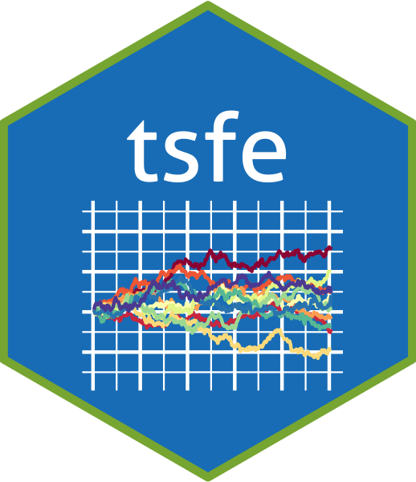

<!-- README.md is generated from README.Rmd. Please edit that file -->

# tsfe



[](https://zenodo.org/badge/latestdoi/342634123)

This package contains templates for reports, and functions and workshops
using in [*Time series financial
econometrics*](https://canvas.qub.ac.uk/courses/11736) taught by [Barry
Quinn](https://quinference.com/) at Queen’s Management School.

## Installation

``` r
remotes::install_github("quinfer/tsfe")
```

And the development version from [GitHub](https://github.com/) with:

``` r
# install.packages("devtools")
devtools::install_github("quinfer/tsfe")
```

## Example

This is a basic example which shows you how to solve a common problem:

``` r
library(tsfe)
## basic example code
data("ftse350")  # This is a 2MB file so might take some time to initially load
summary(ftse350)
#>      Name              ticker            variable              date           
#>  Length:1014400     Length:1014400     Length:1014400     Min.   :2016-04-29  
#>  Class :character   Class :character   Class :character   1st Qu.:2017-06-14  
#>  Mode  :character   Mode  :character   Mode  :character   Median :2018-07-20  
#>                                                           Mean   :2018-07-13  
#>                                                           3rd Qu.:2019-08-14  
#>                                                           Max.   :2020-09-01  
#>      value          
#>  Min.   :     1.05  
#>  1st Qu.:   373.10  
#>  Median :   893.92  
#>  Mean   :  3273.80  
#>  3rd Qu.:  2210.00  
#>  Max.   :159163.60
```

## Tutorials

You can start the tutorials in one of two ways. First, in RStudio 1.3 or
later, you will find the ATI tutorials listed in the “Tutorial” tab in
the top-right pane (by default). Find a tutorial and click “Run
Tutorial” to get started. Second, you can run any tutorial from the R
console by typing the following line:

``` r
learnr::run_tutorial("Workshop2","tsfe")
```

This should bring up a tutorial in your default web browser. You can see
the full list of tutorials by running:

``` r
learnr::run_tutorial(package = "tsfe")
```

If you would like to access the raw RMarkdown code which created these
tutorials you can do so
[here](https://github.com/barryquinn1/tsfe/tree/master/inst/tutorials)

## Project Report

This package also includes a RMarkdown template for use in the project
report. Go to File\>New\>R Markdown… and choose from `From Template`
then `project-report`. There are four sections in the report

-   Introduction and literature review
-   Data and methodology
-   Results
-   Discussion

The marks are allocated equally to each section.

### Indicative marking scheme

+-------+-------+-------+-------+-------+-------+-------+-------+-------+
| crit  | d     | d     | descr | de    | value | value | valu  | v     |
| erion | escri | escri | iptio | scrip | \\\_E | \\\_A | e\\\_ | alue\ |
|       | ption | ption | n\\\_ | tion\ | xpect | pproa | Meets | \\_Ex |
|       | \\\_E | \\\_A | Meets | \\_Ex | ation | ching | E     | ceeds |
|       | xpect | pproa | E     | ceeds | not   | E     | xpect | E     |
|       | ation | ching | xpect | E     | met   | xpect | ation | xpect |
|       | not   | E     | ation | xpect |       | ation |       | ation |
|       | met   | xpect |       | ation |       |       |       |       |
|       |       | ation |       |       |       |       |       |       |
+:======+:======+:======+:======+:======+:======+:======+:======+:======+
| Intr  | The   | The   | An    | A     | 5     | 15    | 20    | 25    |
| o+Lit | in    | in    | ade   | very  |       |       |       |       |
|       | trodu | trodu | quate | good  |       |       |       |       |
|       | ction | ction | in    | in    |       |       |       |       |
|       | needs | br    | trodu | trodu |       |       |       |       |
|       | a lot | oadly | ction | ction |       |       |       |       |
|       | more  | sets  | which | which |       |       |       |       |
|       | work. | out   | br    | is    |       |       |       |       |
|       | A     | the   | oadly | easy  |       |       |       |       |
|       | poor  | pr    | sets  | to    |       |       |       |       |
|       | and   | oblem | out   | read  |       |       |       |       |
|       | incom | but   | the   | and   |       |       |       |       |
|       | plete | could | pro   | intro |       |       |       |       |
|       | r     | be    | blem. | duces |       |       |       |       |
|       | eview | much  | A     | the   |       |       |       |       |
|       | of    | impr  | good  | pr    |       |       |       |       |
|       | the   | oved. | liter | oblem |       |       |       |       |
|       | liter | The   | ature | well, |       |       |       |       |
|       | ature | liter | r     | se    |       |       |       |       |
|       | which | ature | eview | tting |       |       |       |       |
|       | do    | r     | that  | out   |       |       |       |       |
|       | esn’t | eview | sets  | the   |       |       |       |       |
|       | show  | req   | out   | ov    |       |       |       |       |
|       | any   | uires | some  | erall |       |       |       |       |
|       | cri   | more  | of    | pr    |       |       |       |       |
|       | tical | co    | the   | oject |       |       |       |       |
|       | abi   | ntent | rel   | aim.  |       |       |       |       |
|       | lity. | and   | evant | A     |       |       |       |       |
|       |       | cri   | liter | very  |       |       |       |       |
|       |       | tical | ature | good  |       |       |       |       |
|       |       | com   | but   | liter |       |       |       |       |
|       |       | ment. | need  | ature |       |       |       |       |
|       |       |       | more  | re    |       |       |       |       |
|       |       |       | crit  | view, |       |       |       |       |
|       |       |       | ique. | deta  |       |       |       |       |
|       |       |       |       | iling |       |       |       |       |
|       |       |       |       | the   |       |       |       |       |
|       |       |       |       | rel   |       |       |       |       |
|       |       |       |       | evant |       |       |       |       |
|       |       |       |       | liter |       |       |       |       |
|       |       |       |       | ature |       |       |       |       |
|       |       |       |       | and   |       |       |       |       |
|       |       |       |       | criti |       |       |       |       |
|       |       |       |       | quing |       |       |       |       |
|       |       |       |       | it.   |       |       |       |       |
+-------+-------+-------+-------+-------+-------+-------+-------+-------+
| Da    | A     | A     | A     | A     | 5     | 15    | 20    | 25    |
| ta+me | poor  | pprop | good  | very  |       |       |       |       |
| thods | model | riate | model | good  |       |       |       |       |
|       | is    | model | cons  | model |       |       |       |       |
|       | used  | and   | truct | co    |       |       |       |       |
|       | with  | estim | and   | nstru |       |       |       |       |
|       | very  | ation | use   | ction |       |       |       |       |
|       | l     | techn | of    | with  |       |       |       |       |
|       | ittle | iques | the   | cri   |       |       |       |       |
|       | cri   | are   | sta   | tical |       |       |       |       |
|       | tical | used  | ndard | com   |       |       |       |       |
|       | com   | but   | estim | ments |       |       |       |       |
|       | ment. | l     | ation | of    |       |       |       |       |
|       |       | ittle | t     | its   |       |       |       |       |
|       |       | cri   | echni | use.  |       |       |       |       |
|       |       | tique | ques. | Estim |       |       |       |       |
|       |       | is    | There | ation |       |       |       |       |
|       |       | used. | is    | techn |       |       |       |       |
|       |       |       | some  | iques |       |       |       |       |
|       |       |       | cri   | are   |       |       |       |       |
|       |       |       | tique | well  |       |       |       |       |
|       |       |       | of    | laid  |       |       |       |       |
|       |       |       | the   | out   |       |       |       |       |
|       |       |       | met   | and   |       |       |       |       |
|       |       |       | hods. | criti |       |       |       |       |
|       |       |       |       | qued, |       |       |       |       |
|       |       |       |       | with  |       |       |       |       |
|       |       |       |       | some  |       |       |       |       |
|       |       |       |       | im    |       |       |       |       |
|       |       |       |       | prove |       |       |       |       |
|       |       |       |       | ments |       |       |       |       |
|       |       |       |       | menti |       |       |       |       |
|       |       |       |       | oned. |       |       |       |       |
+-------+-------+-------+-------+-------+-------+-------+-------+-------+
| Re    | Re    | Poor  | There | Very  | 5     | 15    | 20    | 25    |
| sults | sults | use   | is    | good  |       |       |       |       |
|       | are   | of    | a     | use   |       |       |       |       |
|       | not   | g     | pprop | is    |       |       |       |       |
|       | well  | raphs | riate | made  |       |       |       |       |
|       | de    | and   | use   | of    |       |       |       |       |
|       | fined | ta    | of    | both  |       |       |       |       |
|       | and   | bles. | both  | t     |       |       |       |       |
|       | the   | Infer | t     | ables |       |       |       |       |
|       | use   | ences | ables | and   |       |       |       |       |
|       | of    | are   | and   | gr    |       |       |       |       |
|       | t     | poor  | gr    | aphs. |       |       |       |       |
|       | ables | and   | aphs. | The   |       |       |       |       |
|       | and   | are   | The   | most  |       |       |       |       |
|       | g     | not   | infer | i     |       |       |       |       |
|       | raphs | well  | ences | ntere |       |       |       |       |
|       | needs | re    | on    | sting |       |       |       |       |
|       | much  | lated | re    | fea   |       |       |       |       |
|       | more  | to    | sults | tures |       |       |       |       |
|       | work. | pre   | are   | of    |       |       |       |       |
|       |       | vious | good  | the   |       |       |       |       |
|       |       | empi  | but   | re    |       |       |       |       |
|       |       | rical | have  | sults |       |       |       |       |
|       |       | rese  | s     | are   |       |       |       |       |
|       |       | arch. | parse | well  |       |       |       |       |
|       |       |       | cri   | ident |       |       |       |       |
|       |       |       | tical | ified |       |       |       |       |
|       |       |       | comm  | with  |       |       |       |       |
|       |       |       | ents. | infer |       |       |       |       |
|       |       |       | I     | ences |       |       |       |       |
|       |       |       | mprov | re    |       |       |       |       |
|       |       |       | ement | lated |       |       |       |       |
|       |       |       | could | to    |       |       |       |       |
|       |       |       | be    | ov    |       |       |       |       |
|       |       |       | made  | erall |       |       |       |       |
|       |       |       | with  | pr    |       |       |       |       |
|       |       |       | more  | oject |       |       |       |       |
|       |       |       | conte | aims. |       |       |       |       |
|       |       |       | xtual | A     |       |       |       |       |
|       |       |       | co    | exce  |       |       |       |       |
|       |       |       | mment | llent |       |       |       |       |
|       |       |       | about | cri   |       |       |       |       |
|       |       |       | pre   | tique |       |       |       |       |
|       |       |       | vious | of    |       |       |       |       |
|       |       |       | empi  | your  |       |       |       |       |
|       |       |       | rical | re    |       |       |       |       |
|       |       |       | res   | sults |       |       |       |       |
|       |       |       | ults. | using |       |       |       |       |
|       |       |       |       | pre   |       |       |       |       |
|       |       |       |       | vious |       |       |       |       |
|       |       |       |       | empi  |       |       |       |       |
|       |       |       |       | rical |       |       |       |       |
|       |       |       |       | rese  |       |       |       |       |
|       |       |       |       | arch. |       |       |       |       |
+-------+-------+-------+-------+-------+-------+-------+-------+-------+
| Discu | Poor  | Some  | Good  | Exce  | 5     | 15    | 20    | 25    |
| ssion | and   | infe  | use   | llent |       |       |       |       |
|       | incom | rence | of    | use   |       |       |       |       |
|       | plete | from  | cri   | of    |       |       |       |       |
|       | infer | the   | tical | cri   |       |       |       |       |
|       | ences | pre   | infer | tical |       |       |       |       |
|       | and   | vious | ences | infer |       |       |       |       |
|       | c     | sect  | with  | ences |       |       |       |       |
|       | onclu | ions. | some  | with  |       |       |       |       |
|       | sions |       | refe  | well  |       |       |       |       |
|       | from  |       | rence | th    |       |       |       |       |
|       | the   |       | to    | ought |       |       |       |       |
|       | pre   |       | how   | out   |       |       |       |       |
|       | vious |       | fin   | cri   |       |       |       |       |
|       | sec   |       | dings | tique |       |       |       |       |
|       | tions |       | are   | given |       |       |       |       |
|       |       |       | re    | the   |       |       |       |       |
|       |       |       | lated | liter |       |       |       |       |
|       |       |       | to    | ature |       |       |       |       |
|       |       |       | the   | desc  |       |       |       |       |
|       |       |       | exi   | ribed |       |       |       |       |
|       |       |       | sting | in    |       |       |       |       |
|       |       |       | l     | the   |       |       |       |       |
|       |       |       | itera | pre   |       |       |       |       |
|       |       |       | ture. | vious |       |       |       |       |
|       |       |       |       | sect  |       |       |       |       |
|       |       |       |       | ions. |       |       |       |       |
+-------+-------+-------+-------+-------+-------+-------+-------+-------+
| Ori   | La    | Very  | Very  | Tho   | 5     | 18    | 28    | 40    |
| ginal | cking | good  | good  | rough |       |       |       |       |
| ity + | meth  | know  | know  | and   |       |       |       |       |
| Refle | odolo | ledge | ledge | syste |       |       |       |       |
| ctive | gical | and   | and   | matic |       |       |       |       |
| Essay | ap    | und   | und   | know  |       |       |       |       |
|       | plica | ersta | ersta | ledge |       |       |       |       |
|       | tion. | nding | nding | and   |       |       |       |       |
|       | Adequ | of    | of    | und   |       |       |       |       |
|       | ately | m     | m     | ersta |       |       |       |       |
|       | ar    | odule | odule | nding |       |       |       |       |
|       | gued. | con   | con   | of    |       |       |       |       |
|       | Basic | tent. | tent. | the   |       |       |       |       |
|       | und   | Well  | Well  | m     |       |       |       |       |
|       | ersta | a     | a     | odule |       |       |       |       |
|       | nding | rgued | rgued | con   |       |       |       |       |
|       | and   | ans   | ans   | tent. |       |       |       |       |
|       | knowl | wers. | wers. | A     |       |       |       |       |
|       | edge. | Evi   | Evi   | clear |       |       |       |       |
|       | Gaps  | dence | dence | grasp |       |       |       |       |
|       | or    | of    | of    | of    |       |       |       |       |
|       | in    | o     | o     | the   |       |       |       |       |
|       | accur | rigin | rigin | i     |       |       |       |       |
|       | acies | ality | ality | ssues |       |       |       |       |
|       | but   | and   | and   | invo  |       |       |       |       |
|       | not   | cri   | cri   | lved, |       |       |       |       |
|       | damag | tical | tical | with  |       |       |       |       |
|       | ing.L | judge | judge | evi   |       |       |       |       |
|       | ittle | ment. | ment. | dence |       |       |       |       |
|       | rele  | Sound | Sound | of    |       |       |       |       |
|       | vance | me    | me    | innov |       |       |       |       |
|       | mat   | thodo | thodo | ative |       |       |       |       |
|       | erial | logy. | logy. | and   |       |       |       |       |
|       | a     | Cri   | Cri   | the   |       |       |       |       |
|       | nd/or | tical | tical | ori   |       |       |       |       |
|       | inacc | judg  | judg  | ginal |       |       |       |       |
|       | urate | ement | ement | use   |       |       |       |       |
|       | a     | and   | and   | of    |       |       |       |       |
|       | nswer | some  | some  | lea   |       |       |       |       |
|       | or    | grasp | grasp | rning |       |       |       |       |
|       | i     | of    | of    | resou |       |       |       |       |
|       | ncomp | co    | co    | rces. |       |       |       |       |
|       | lete. | mplex | mplex | Know  |       |       |       |       |
|       | Di    | issue | issu  | ledge |       |       |       |       |
|       | sorga | sGood |       | b     |       |       |       |       |
|       | nised | know  |       | eyond |       |       |       |       |
|       | and   | ledge |       | m     |       |       |       |       |
|       | irrel | and   |       | odule |       |       |       |       |
|       | evant | und   |       | con   |       |       |       |       |
|       | mat   | ersta |       | tent. |       |       |       |       |
|       | erial | nding |       | Clear |       |       |       |       |
|       | and   | of    |       | evi   |       |       |       |       |
|       | mi    | the   |       | dence |       |       |       |       |
|       | sunde | m     |       | of    |       |       |       |       |
|       | rstan | odule |       | i     |       |       |       |       |
|       | ding. | con   |       | ndepe |       |       |       |       |
|       | Mi    | tent. |       | ndent |       |       |       |       |
|       | nimal | Reaso |       | th    |       |       |       |       |
|       | or no | nably |       | ought |       |       |       |       |
|       | rel   | we    |       | and   |       |       |       |       |
|       | evant | ll-ar |       | or    |       |       |       |       |
|       | mate  | gued. |       | igina |       |       |       |       |
|       | rial. | La    |       | lity. |       |       |       |       |
|       |       | rgely |       | Meth  |       |       |       |       |
|       |       | d     |       | odolo |       |       |       |       |
|       |       | escri |       | gical |       |       |       |       |
|       |       | ptive |       | ri    |       |       |       |       |
|       |       | or    |       | gour. |       |       |       |       |
|       |       | narr  |       | High  |       |       |       |       |
|       |       | ative |       | cri   |       |       |       |       |
|       |       | in    |       | tical |       |       |       |       |
|       |       | f     |       | judg  |       |       |       |       |
|       |       | ocus. |       | ement |       |       |       |       |
|       |       | Meth  |       | and a |       |       |       |       |
|       |       | odolo |       | conf  |       |       |       |       |
|       |       | gical |       | ident |       |       |       |       |
|       |       | a     |       | grasp |       |       |       |       |
|       |       | pplic |       | of    |       |       |       |       |
|       |       | ation |       | co    |       |       |       |       |
|       |       | is    |       | mplex |       |       |       |       |
|       |       | not   |       | i     |       |       |       |       |
|       |       | consi |       | ssues |       |       |       |       |
|       |       | stent |       |       |       |       |       |       |
|       |       | or    |       |       |       |       |       |       |
|       |       | thor  |       |       |       |       |       |       |
|       |       | ough. |       |       |       |       |       |       |
+-------+-------+-------+-------+-------+-------+-------+-------+-------+

## Datasets

This package also includes dataset used in the course
